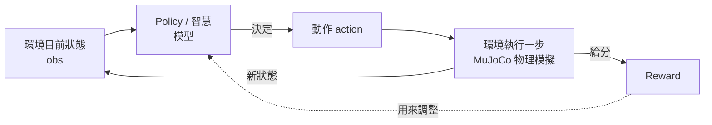

# 🧠 強化學習原理與自訂 ORCA Hand 獎勵機制教學


> 目標:看懂「訓練」背後到底在算什麼,並學會自己寫一個客製化的 reward function,取代官方內建的方塊定向任務。

---

## 📑 目錄

1. [大方向:RL 到底在解決什麼問題](#1-大方向rl-到底在解決什麼問題)
2. [核心概念拆解](#2-核心概念拆解)
3. [PPO 在學什麼(直覺版,不看數學推導)](#3-ppo-在學什麼直覺版不看數學推導)
4. [Reward 設計的原則與常見陷阱](#4-reward-設計的原則與常見陷阱)
5. [動手前:先看懂你手上這個環境長什麼樣](#5-動手前先看懂你手上這個環境長什麼樣)
6. [自己寫一個自訂 Gymnasium 環境 + 自訂 reward](#6-自己寫一個自訂-gymnasium-環境--自訂-reward)
7. [把自訂 reward 接上 PPO 訓練](#7-把自訂-reward-接上-ppo-訓練)
8. [除錯:怎麼知道 reward 設計得好不好](#8-除錯怎麼知道-reward-設計得好不好)
9. [參考資料](#9-參考資料)

---

## 1. 大方向:RL 到底在解決什麼問題

強化學習(Reinforcement Learning, RL)在解決的問題,本質上就是:

> **一個 agent(這裡是「手的控制策略」)不斷跟環境互動,靠試錯 + 獎勵訊號,自己摸索出「在什麼狀態下,做什麼動作,長期下來分數最高」。**

沒有人手把手教它「先彎食指、再彎拇指」,它是自己亂試,試出高分的動作組合就會被強化(增加以後再做的機率),試出低分的就會被削弱。這整個迴圈長這樣:



這跟你之前寫的隨機動作程式碼,迴圈結構其實一模一樣(`reset → step → reset → step...`),差別只在「動作從哪裡來」:

| | 隨機策略 | 訓練後的策略 |
|---|---|---|
| 動作來源 | `env.action_space.sample()` | `model.predict(obs)` |
| 有沒有目標感 | 沒有 | 有(被 reward 引導出來的) |

---

## 2. 核心概念拆解

RL 的數學框架叫 **MDP(Markov Decision Process)**,聽起來嚇人,但拆開就是幾個你已經在程式碼裡用過的東西:

| 術語 | 白話解釋 | 對應到程式碼 |
|---|---|---|
| **State / Observation(狀態/觀測)** | 環境目前長什麼樣,agent 能看到的資訊(關節角度、方塊姿態等) | `obs` |
| **Action(動作)** | agent 能做的操作(每個關節要轉到哪個角度) | `action` |
| **Reward(獎勵)** | 這一步做得好不好的**單一數字**評分 | `reward` |
| **Policy(策略)** | 一個函式:輸入 obs,輸出 action。訓練的目標就是找到一個好的 policy | 訓練前是隨機抽樣,訓練後是 `model.predict()` |
| **Episode(一輪/一局)** | 從 `reset()` 到 `terminated`/`truncated` 之間的一連串互動 | 你的 `for` 迴圈裡一輪 |
| **Return(累積報酬)** | 一整個 episode 裡所有 reward 加總(通常會做 discount,越晚拿到的分打折) | agent 真正想最大化的東西,不是單步 reward |
| **Discount factor γ(折扣因子)** | 決定 agent 有多「短視」還是「有遠見」,通常設 0.99 左右 | PPO 內部超參數,通常不用自己算 |

**重點觀念**:agent 優化的不是「這一步的分數」,而是「整個 episode 累積下來的分數」。所以 reward 不用每一步都給獎勵滿分才對,常常是「稀疏但正確」的訊號效果更好(下一節會細講)。

---

## 3. PPO 在學什麼(直覺版,不看數學推導)

你訓練腳本裡用的 **PPO(Proximal Policy Optimization)**,是目前業界最常用、最穩定的 RL 演算法之一。直覺上它在做的事:

1. 用目前的 policy(一開始是隨機的)去跑很多次 episode,收集「obs → action → reward」的資料
2. 分析:哪些動作平均而言帶來比較高的 reward?
3. **稍微**調整 policy 的參數,讓它更傾向做那些「好」的動作 —— 注意是「稍微」,PPO 的核心設計就是限制每次更新的幅度不要太大(這就是 Proximal「鄰近」這個字的由來),避免一次調過頭把已經學會的東西搞壞
4. 重複步驟 1-3 成千上萬次,policy 就會越來越擅長這個任務

你不需要自己去實作梯度計算、反向傳播這些細節,Stable-Baselines3 都幫你包好了。**你真正要花心思的,是設計 reward function** —— 因為 PPO 只會忠實地去最大化你給的 reward,你給錯目標,它就會學出你意料之外(但技術上「正確」)的怪異行為。這就是下一節要講的。

---

## 4. Reward 設計的原則與常見陷阱

### 4.1 稀疏 reward vs 密集 reward

| 類型 | 範例 | 優點 | 缺點 |
|---|---|---|---|
| **稀疏(sparse)** | 完全轉到目標姿態才 +1,其他都 0 | 目標明確,不會被誤導 | 訓練初期幾乎抽不到成功案例,學得很慢 |
| **密集(dense)** | 每一步都算「離目標還差多少」,越接近分數越高 | 訓練訊號豐富,學得快 | 容易「獎勵駭客(reward hacking)」—— agent 找到你沒想到的取巧方式拿高分,卻沒真正完成任務 |

實務上常見做法是**密集 + 稀疏混合**:平常用密集分數引導,真正達成目標時再給一個額外大獎勵(bonus)。

### 4.2 常見陷阱:Reward Hacking

這是寫 reward 最容易踩到的坑 —— agent 會不擇手段鑽你 reward 公式的漏洞。舉例:

- 你想讓手把方塊轉正,reward 用「方塊旋轉角速度」當獎勵 → agent 學會讓方塊瘋狂旋轉刷分,而不是轉到定點就停
- 你獎勵「手指跟方塊的距離越近越好」→ agent 學會把方塊壓扁貼在手掌上不放開,而不是靈巧操作

**對策**:reward 公式寫完之後,自己先假想幾種「取巧但技術上分數很高」的行為,檢查公式會不會被鑽漏洞。

### 4.3 Reward 的尺度(scale)要一致

如果你把好幾個項目加在一起(例如:姿態誤差 + 動作平滑度懲罰 + 完成 bonus),要注意每一項的數值範圍不要差太多個數量級,不然某一項會完全主導訓練方向。常見做法是把每一項都正規化到差不多 [-1, 1] 或 [0, 1] 的範圍,再乘上你想要的權重去加總。

---

## 5. 動手前:先看懂你手上這個環境長什麼樣

寫自訂 reward 之前,**強烈建議先實際印出來看這個環境的 obs、action 長什麼樣**,不要憑猜測寫程式。存成 `inspect_env.py` 跑一次:

```python
from orca_sim import OrcaHandRightCubeOrientation

env = OrcaHandRightCubeOrientation(version="v2")
obs, info = env.reset(seed=0)

print("observation_space:", env.observation_space)
print("action_space:", env.action_space)
print("obs shape:", obs.shape)
print("obs 內容:", obs)
print("info:", info)

# 跑一步看看 obs 怎麼變化,順便看 reward 大概是什麼範圍
action = env.action_space.sample()
obs2, reward, terminated, truncated, info = env.step(action)
print("reward 範例值:", reward)

env.close()
```

跑完你就會知道:obs 是幾維的向量、大概包含什麼資訊、reward 預設範圍大概多少 —— 這些是寫自訂 reward 的基礎。

**另外,想看官方任務的 reward 到底怎麼算的,可以直接打開安裝好的原始碼**,用下面指令找到檔案位置:

```bash
python -c "import orca_sim, os; print(os.path.dirname(orca_sim.__file__))"
```

跑出來的路徑底下有一個 `task_envs.py`,裡面就是 `OrcaHandRightCubeOrientation` 的完整實作(reset 邏輯、reward 公式全部都在裡面),官方 README 也特別說明這份程式碼是刻意寫成「可以照抄改造的範本」。**這是你寫自己 reward 時最重要的參考資料**,因為裡面的 body / site 名稱會直接對應到 MJCF 場景檔案,跟你自己的模型定義要一致。

---

## 6. 自己寫一個自訂 Gymnasium 環境 + 自訂 reward

下面是一個**通用的 MuJoCo + Gymnasium 自訂環境範本**,結構上跟 `task_envs.py` 是同一套寫法(繼承 `gymnasium.Env`、用 `mujoco` 這個套件直接操作物理模型)。你可以照這個骨架,把 `_compute_reward()` 換成你自己想要的任務邏輯。

```python
import numpy as np
import mujoco
import gymnasium as gym
from gymnasium import spaces


class MyCustomOrcaTask(gym.Env):
    metadata = {"render_modes": ["human", "rgb_array"], "render_fps": 50}

    def __init__(self, xml_path: str, render_mode: str | None = None):
        super().__init__()

        # 讀取 MJCF 場景檔(可以直接沿用 orca_sim 提供的手部場景,
        # 或是你自己修改過、加了新物件的版本)
        self.model = mujoco.MjModel.from_xml_path(xml_path)
        self.data = mujoco.MjData(self.model)

        self.render_mode = render_mode
        self._viewer = None

        # === 定義動作空間:通常是每個關節的目標角度範圍 ===
        n_actuators = self.model.nu
        self.action_space = spaces.Box(
            low=-1.0, high=1.0, shape=(n_actuators,), dtype=np.float32
        )

        # === 定義觀測空間:這裡先簡單用「所有關節角度 + 角速度」示範 ===
        obs_dim = self.model.nq + self.model.nv
        self.observation_space = spaces.Box(
            low=-np.inf, high=np.inf, shape=(obs_dim,), dtype=np.float32
        )

    def _get_obs(self):
        return np.concatenate([self.data.qpos, self.data.qvel]).astype(np.float32)

    def _compute_reward(self):
        """
        ★★★ 這裡就是你要自己設計的地方 ★★★

        範例邏輯(請換成你真正想要的任務):
        用某個 body(例如手指指尖)跟目標 site 的距離當作 dense reward,
        距離越小分數越高;真的碰到目標時額外給 bonus。
        """
        # 舉例:抓取 body 位置(名稱要跟你的 XML 裡定義的一致)
        # fingertip_pos = self.data.body("index_fingertip").xpos
        # target_pos = self.data.site("target_site").xpos
        # dist = np.linalg.norm(fingertip_pos - target_pos)
        #
        # dense_reward = -dist                     # 距離懲罰(越近越好)
        # success = dist < 0.01
        # bonus = 5.0 if success else 0.0
        # return dense_reward + bonus, success

        # 這裡先放一個永遠回傳 0 的假 reward,提醒你一定要換成自己的邏輯
        return 0.0, False

    def reset(self, *, seed=None, options=None):
        super().reset(seed=seed)
        mujoco.mj_resetData(self.model, self.data)

        # 如果想要每次重置都隨機初始姿態,可以在這裡對 qpos 加噪聲
        # self.data.qpos[:] += self.np_random.uniform(-0.05, 0.05, size=self.model.nq)

        mujoco.mj_forward(self.model, self.data)
        obs = self._get_obs()
        info = {}
        return obs, info

    def step(self, action):
        # 把 [-1, 1] 的 action 映射到實際的關節控制訊號
        self.data.ctrl[:] = action

        mujoco.mj_step(self.model, self.data)

        obs = self._get_obs()
        reward, success = self._compute_reward()

        terminated = bool(success)   # 任務成功 → 這輪結束
        truncated = False            # 通常在外面用 TimeLimit wrapper 控制步數上限
        info = {"success": success}

        if self.render_mode == "human":
            self.render()

        return obs, reward, terminated, truncated, info

    def render(self):
        if self._viewer is None:
            import mujoco.viewer
            self._viewer = mujoco.viewer.launch_passive(self.model, self.data)
        self._viewer.sync()

    def close(self):
        if self._viewer is not None:
            self._viewer.close()
```

**幾個要注意的地方:**

- `self.data.body("名稱").xpos` / `.xquat`:這是 MuJoCo 官方 Python API 取得某個 body 目前位置 / 姿態(四元數)的標準寫法,「名稱」要跟你 XML 場景檔裡 `<body name="...">` 定義的一致 —— 這也是為什麼上一節要你去看 `task_envs.py` 跟對應的 `.xml`,才能知道正確名稱怎麼寫
- `mujoco.mj_step()`:讓物理引擎往前推進一個時間步,是整個模擬的心臟
- `TimeLimit`:Gymnasium 有內建的 `gymnasium.wrappers.TimeLimit`,可以幫你自動處理「超過 N 步就 truncated」,不用自己在 `step()` 裡算步數

如果你只是想**修改內建任務的 reward**,而不是整個重寫環境,更簡單的做法是直接繼承 `OrcaHandRightCubeOrientation`,覆寫裡面算 reward 的那個方法就好(方法名稱要對照你在 `task_envs.py` 裡實際看到的寫法,不同版本可能不同):

```python
from orca_sim import OrcaHandRightCubeOrientation

class MyCubeTask(OrcaHandRightCubeOrientation):
    def _compute_reward(self, *args, **kwargs):
        # 呼叫原本的邏輯拿基礎分數,或是完全自己重寫都可以
        # base_reward, success = super()._compute_reward(*args, **kwargs)
        # 在這裡加上你自己想要的額外項目
        ...
```

---

## 7. 把自訂 reward 接上 PPO 訓練

寫好自訂環境之後,訓練流程跟之前的 `train.py` 幾乎一樣,只是把 import 換成你自己的類別:

```python
from stable_baselines3 import PPO
from stable_baselines3.common.vec_env import DummyVecEnv
from gymnasium.wrappers import TimeLimit

from my_custom_task import MyCustomOrcaTask   # 換成你自己的檔案/類別

def make_env():
    env = MyCustomOrcaTask(xml_path="path/to/your_scene.xml")
    env = TimeLimit(env, max_episode_steps=500)   # 加上步數上限
    return env

env = DummyVecEnv([make_env])

model = PPO("MlpPolicy", env, verbose=1)
model.learn(total_timesteps=50_000)   # 先小規模測試流程有沒有跑通
model.save("my_custom_policy")
```

**建議的開發流程順序:**

1. 先用**很小的 `total_timesteps`**(例如 5,000)確認整個 pipeline 沒有報錯、reward 數值合理
2. 用 `inspect_env.py` 那套方式,人工檢查幾次 `reward` 的輸出值,確認邏輯符合預期(手動給幾個明顯「好」跟「壞」的動作,看 reward 是不是真的一個高一個低)
3. 確認沒問題後再拉高步數做正式訓練,並用 tensorboard 觀察學習曲線

---

## 8. 除錯:怎麼知道 reward 設計得好不好

| 現象 | 可能的原因 |
|---|---|
| 訓練曲線(reward)完全沒有上升,一直是隨機水準 | reward 太稀疏、或跟動作根本沒有明確關聯;檢查 obs 有沒有包含判斷任務所需的資訊 |
| Reward 一直上升,但實際用 `render_mode="human"` 看起來動作很怪 | 很可能是 reward hacking,agent 找到取巧方式;回頭檢查 4.2 節提到的漏洞 |
| 訓練初期進步很快,後來完全卡住不再進步 | 可能是 reward 尺度沒設好、或任務對目前的 policy 架構太難,可考慮加入課程學習(先從簡單版本開始,逐步加難度) |
| 每次 reset 結果差異很大,學習不穩定 | 檢查 `reset()` 裡的隨機化幅度是不是太大,可以先關掉隨機化,確認能學會固定情境,再逐步加入隨機性 |

---

## 9. 參考資料

- 🌐 官網:https://orcahand.com
- 🧪 orca_sim GitHub:https://github.com/orcahand/orca_sim(任務原始碼在 `src/orca_sim/task_envs.py`)
- 📖 Gymnasium 官方文件(標準 API、`spaces`、`wrappers`):https://gymnasium.farama.org
- 📖 Stable-Baselines3 官方文件(PPO 參數、訓練技巧):https://stable-baselines3.readthedocs.io
- 📖 MuJoCo Python API 文件:https://mujoco.readthedocs.io

> 💡 這份教學裡「自訂環境範本」那段程式碼,是**標準 MuJoCo + Gymnasium 通用寫法**,結構正確可以直接照著改;但裡面像 `body("index_fingertip")` 這種**實際名稱**,一定要對照你自己的 XML 場景檔或 `task_envs.py` 原始碼去確認,不能直接照抄我範例裡寫的名字。
