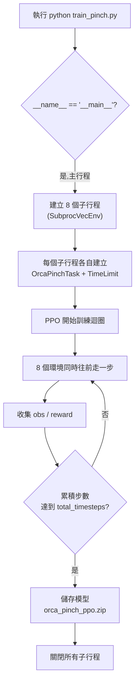

# 🤏 train_pinch.py 完整逐行解說


> 這份文件把 `train_pinch.py` 從頭到尾拆開講,連 Python 語法(巢狀函式、`if __name__`、列表生成式)都會解釋,不假設你已經懂。

---

## 📑 目錄

1. [一句話總覽](#1-一句話總覽)
2. [完整程式碼(對照用)](#2-完整程式碼對照用)
3. [逐區塊解說](#3-逐區塊解說)
4. [整體執行流程圖](#4-整體執行流程圖)
5. [常見疑問 Q&A](#5-常見疑問-qa)
6. [之後想調整,改哪裡](#6-之後想調整改哪裡)

---

## 1. 一句話總覽

> **這支程式做的事:同時開 8 個「虛擬 ORCA 手」在背景平行練習捏合動作,PPO 演算法不斷收集這 8 個手的練習結果、調整控制策略,練滿 200,000 步之後,把學到的策略存成一個檔案。**

---

## 2. 完整程式碼(對照用)

```python
"""
訓練 ORCA 手完成「捏合」任務(拇指指尖碰食指指尖)。
用 SubprocVecEnv 平行跑多個環境加速訓練。

執行前記得:
1. conda activate orca
2. pinch_task.py 要跟這個檔案放在同一個資料夾
"""

from stable_baselines3 import PPO
from stable_baselines3.common.vec_env import SubprocVecEnv
from gymnasium.wrappers import TimeLimit

from pinch_task import OrcaPinchTask


def make_env():
    def _init():
        env = OrcaPinchTask()
        env = TimeLimit(env, max_episode_steps=300)
        return env
    return _init


if __name__ == "__main__":
    N_ENVS = 8

    env = SubprocVecEnv([make_env() for _ in range(N_ENVS)])

    model = PPO(
        "MlpPolicy",
        env,
        verbose=1,
        tensorboard_log="./orca_tensorboard/",
    )

    model.learn(total_timesteps=200_000)

    model.save("orca_pinch_ppo")
    print("訓練完成,模型已存成 orca_pinch_ppo.zip")

    env.close()
```

---

## 3. 逐區塊解說

### 3.1 開頭的三引號說明文字(docstring)

```python
"""
訓練 ORCA 手完成「捏合」任務(拇指指尖碰食指指尖)。
用 SubprocVecEnv 平行跑多個環境加速訓練。

執行前記得:
1. conda activate orca
2. pinch_task.py 要跟這個檔案放在同一個資料夾
"""
```

`"""..."""` 包起來的是**純文字註解**,Python 執行時會直接跳過,只是寫給「人」看的。這裡特別列出兩個「執行前提醒」:

- **`conda activate orca`**:確保終端機用的是裝了 `orca_sim`、`stable_baselines3` 這些套件的環境,不是預設的 `base`(base 裡沒裝這些套件,直接跑會 `ModuleNotFoundError`)
- **`pinch_task.py` 要同資料夾**:因為底下 `from pinch_task import OrcaPinchTask` 這行,Python 是用「檔案名稱」去找模組,兩個檔案不在同一層資料夾就會找不到

### 3.2 匯入(import)區塊

```python
from stable_baselines3 import PPO
from stable_baselines3.common.vec_env import SubprocVecEnv
from gymnasium.wrappers import TimeLimit

from pinch_task import OrcaPinchTask
```

| 這行匯入什麼 | 用來做什麼 |
|---|---|
| `PPO` | 強化學習演算法本體,負責「看 reward、調整策略」 |
| `SubprocVecEnv` | 把多個環境包成「可以平行跑在不同子行程」的容器 |
| `TimeLimit` | 幫環境加上「跑滿 N 步強制結束」的功能 |
| `OrcaPinchTask` | 你自己寫的捏合任務(繼承自 `OrcaHandRight`,見另一份 `pinch_task.py` 的解說) |

### 3.3 `make_env()`:為什麼要「函式包函式」

```python
def make_env():
    def _init():
        env = OrcaPinchTask()
        env = TimeLimit(env, max_episode_steps=300)
        return env
    return _init
```

拆成兩層來看:

**內層 `_init()` 在做什麼:**

1. `env = OrcaPinchTask()`:建立一個捏合任務的環境
2. `env = TimeLimit(env, max_episode_steps=300)`:**在外面包一層** `TimeLimit`,規定這個環境「跑滿 300 步還沒捏合成功,就強制標記結束、重來一輪」。

    為什麼需要這個?因為 `OrcaPinchTask`(繼承自 `OrcaHandRight`)裡的 `_get_truncated()` 永遠回傳 `False` —— 它自己不會因為「跑太久」而喊停,只有真的捏合成功(`_get_terminated()`)才會結束。沒有 `TimeLimit` 的話,萬一 AI 一直捏合失敗,理論上這一輪會無限跑下去。`TimeLimit` 是 Gymnasium 內建好的功能,直接拿來用就好,不用自己寫計數邏輯。

3. `return env`:把包好 `TimeLimit` 的環境回傳出去

**外層 `make_env()` 在做什麼:**

它**不建立環境**,只是 `return _init` —— 把 `_init` 這個**函式本身**(還沒執行的「半成品」)傳出去。

**為什麼要多包這一層?** 因為 `SubprocVecEnv` 要求收到的東西,必須是**一串「函式」**,不能是已經做好的環境物件。原因是:每一個子行程要各自在**自己的行程裡**執行這串「建立環境的說明書」,環境物件本身(裡面包含 MuJoCo 的模擬資料)沒辦法直接「送」到另一個行程,只有「怎麼做」這個函式可以被送過去,讓每個行程自己照做一次。

用蓋房子比喻:`_init` 是「一份蓋房子的設計圖」,`make_env()` 負責「印一份設計圖出來給你」。你不會把蓋好的房子直接搬去另一個工地,而是把設計圖複印 8 份,讓 8 個工地各自照圖蓋一棟。

### 3.4 `if __name__ == "__main__":`

```python
if __name__ == "__main__":
    ...
```

`__name__` 是 Python 自動準備好的內建變數。規則是:**直接執行這個檔案(`python train_pinch.py`)時,`__name__` 會是 `"__main__"`;被其他檔案 `import` 進去時,`__name__` 不會是 `"__main__"`。**

這裡特別重要的原因,是跟 `SubprocVecEnv` 開子行程的機制有關:**在 Windows 上,`SubprocVecEnv` 開新的子行程時,每個子行程都會「重新載入一次」你的程式碼檔案。如果沒有這個 `if` 包住,子行程重新載入時會把「建立 8 個子行程」這件事再做一次,子行程又生子行程,無限循環下去、直接當機或報錯。** 把主要的執行邏輯包在 `if __name__ == "__main__":` 底下,可以確保「開子行程」這個動作只有最一開始、真正執行檔案的那個主行程會做,子行程重新載入檔案時只會拿到函式定義,不會重新觸發整套流程。

### 3.5 `N_ENVS` 與列表生成式

```python
N_ENVS = 8
env = SubprocVecEnv([make_env() for _ in range(N_ENVS)])
```

- `N_ENVS = 8`:設定要平行開幾個環境,建議抓你 CPU 的核心數(或核心數的一半)
- `[make_env() for _ in range(N_ENVS)]`:**列表生成式(list comprehension)**,是「用一行寫完一個迴圈」的精簡寫法,展開等同於:

  ```python
  funcs = []
  for _ in range(N_ENVS):
      funcs.append(make_env())
  ```

  最後 `funcs` 是一個裝了 8 個 `_init` 函式的列表,`SubprocVecEnv(funcs)` 收到這個列表後,會分別開 8 個子行程,每個子行程各自呼叫一次自己拿到的 `_init()`,建立出一個獨立的 `OrcaPinchTask` 環境
- `env = SubprocVecEnv(...)`:表面上 `env` 看起來是「一個環境」,但背後其實藏著 8 個各自獨立、同時在跑的子行程

### 3.6 建立 PPO 模型

```python
model = PPO(
    "MlpPolicy",
    env,
    verbose=1,
    tensorboard_log="./orca_tensorboard/",
)
```

| 參數 | 意思 |
|---|---|
| `"MlpPolicy"` | policy(決策網路)的架構,用一般的多層感知器(全連接神經網路),適合這種輸入是一串數字(不是圖片)的任務 |
| `env` | 剛剛建立好、裝著 8 個子行程的向量化環境 |
| `verbose=1` | 訓練過程中把進度、統計數字印在終端機上,方便你邊跑邊看 |
| `tensorboard_log="./orca_tensorboard/"` | 把訓練紀錄存到這個資料夾,之後可以用 `tensorboard --logdir ./orca_tensorboard/` 打開網頁看學習曲線 |

### 3.7 開始訓練

```python
model.learn(total_timesteps=200_000)
```

- `total_timesteps=200_000`:訓練的**總步數**(8 個環境的步數加起來算)。這是實際「開始跑」的那一行,呼叫下去之後,PPO 會不斷:讓 8 個環境同時往前走 → 收集資料 → 更新一次策略 → 繼續走,直到總步數滿 200,000 為止
- `200_000` 這個數字用底線 `_` 分隔,純粹是 Python 語法上讓長數字**方便閱讀**的寫法(`200_000` 跟 `200000` 對電腦來說是同一個數字,底線會被自動忽略,只是給人看的)

### 3.8 存檔與關閉

```python
model.save("orca_pinch_ppo")
print("訓練完成,模型已存成 orca_pinch_ppo.zip")

env.close()
```

- `model.save("orca_pinch_ppo")`:把訓練好的策略(神經網路的參數)存成一個檔案,實際上會存成 `orca_pinch_ppo.zip`
- `print(...)`:單純印一行訊息,提醒你訓練跑完了
- `env.close()`:把 8 個子行程都關掉,釋放資源(不關的話,子行程可能會繼續佔用記憶體)

---

## 4. 整體執行流程圖



---

## 5. 常見疑問 Q&A

**Q:`DummyVecEnv` 跟 `SubprocVecEnv` 到底差在哪?**

| | `DummyVecEnv` | `SubprocVecEnv` |
|---|---|---|
| 環境跑在哪 | 全部擠在同一個 Python 行程,循序輪流跑 | 每個環境各自一個獨立子行程,真正同時跑 |
| 速度 | 較慢 | 較快(吃多核心 CPU) |
| 適合場合 | 環境很輕量、或只是測試邏輯 | 環境運算量大(像 MuJoCo 物理模擬),想加速 |

**Q:為什麼不能直接把 `OrcaPinchTask()` 塞給 `SubprocVecEnv`,一定要包兩層函式?**

因為子行程沒辦法直接「接收」一個已經建立好、裡面包著 MuJoCo 模擬資料的物件(這類物件通常無法正確地在行程之間傳遞/序列化)。只能傳「怎麼建立」這件事的**說明書(函式)**過去,讓每個子行程自己動手建立一份屬於自己的環境。

**Q:如果我不加 `if __name__ == "__main__":` 會怎樣?**

在 Windows 上跑 `SubprocVecEnv` 極可能會出現「不斷開新視窗/新行程」或是丟出 `RuntimeError`,因為每個子行程重新載入檔案時,會把整份程式(包含「開子行程」那一步)當作主程式重新跑一次。加上這個 `if` 判斷後,子行程重新載入檔案只會定義函式,不會真的觸發 `SubprocVecEnv(...)` 那些程式碼。

**Q:`TimeLimit` 跟 `_get_terminated()` 有什麼不一樣?**

- `_get_terminated()`(你在 `pinch_task.py` 裡自己寫的):代表「任務**真的成功**了」(捏合到位)
- `TimeLimit` 造成的 `truncated`:代表「時間到、**放棄**這一輪,不是成功,只是不想再等了」

兩者都會讓這一輪(episode)結束、觸發 `reset()`,但意義不同,PPO 內部也會用不同方式處理這兩種情況(`terminated` 通常代表「這裡是真正的終點,不用估計後續價值」;`truncated` 代表「只是暫停,理論上後面還有價值」)。

---

## 6. 之後想調整,改哪裡

| 想做的事 | 改哪個地方 |
|---|---|
| 想跑更久、更充分訓練 | 把 `total_timesteps=200_000` 拉高 |
| 電腦核心數比較少,跑起來很卡 | 把 `N_ENVS = 8` 改小,例如 `4` |
| 覺得 300 步還沒捏合就重來太早/太晚 | 改 `max_episode_steps=300` 這個數字 |
| 想看訓練有沒有在進步 | 訓練時另開一個終端機跑 `tensorboard --logdir ./orca_tensorboard/`,瀏覽器打開看 `rollout/ep_rew_mean` 那條線 |
| 想存成別的檔名 | 改 `model.save("orca_pinch_ppo")` 裡的字串 |
