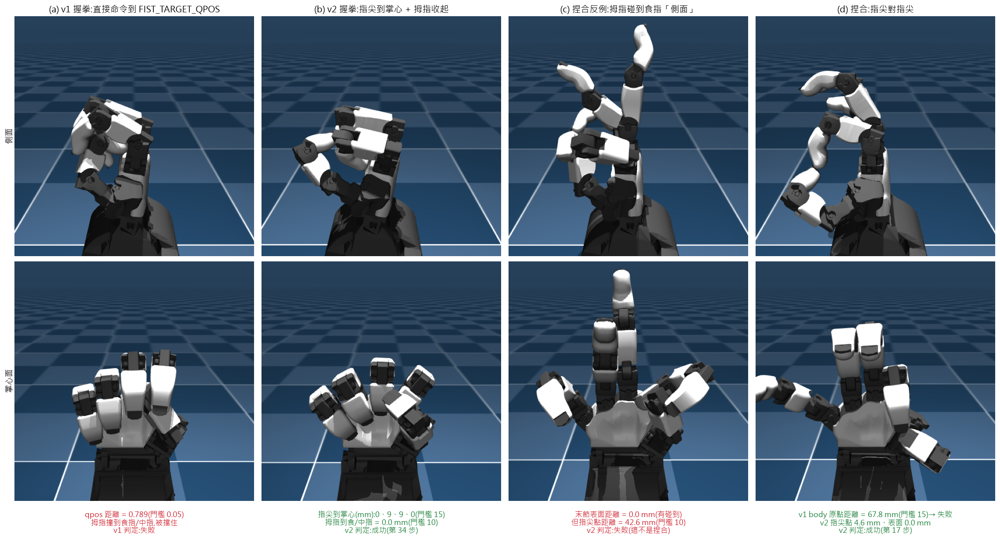
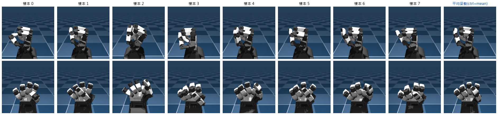
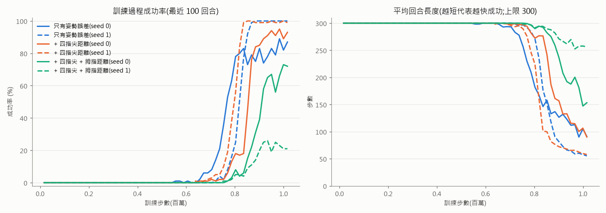
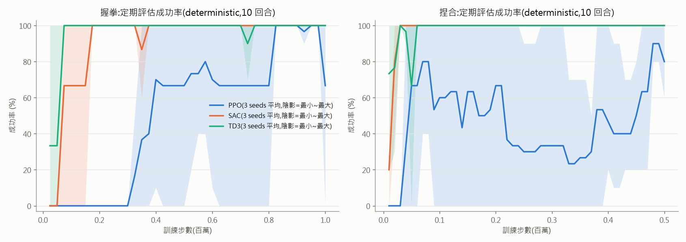
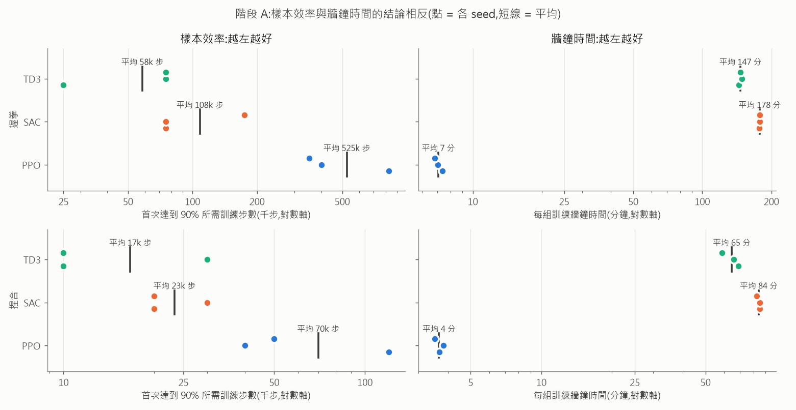
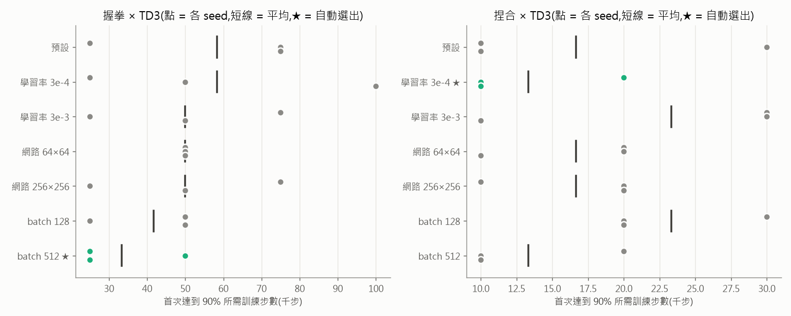
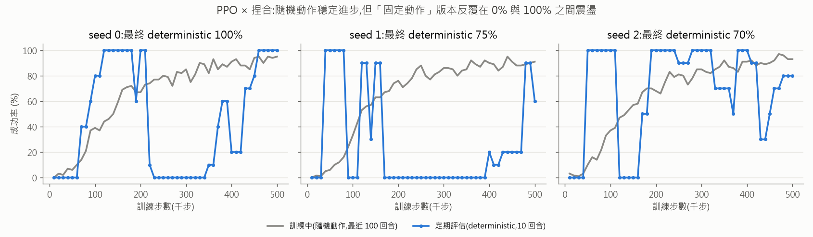

# 擬人化機械手之強化學習演算法與超參數比較:以 ORCA Hand 握拳與捏合任務為例

**日期**:2026 年 10 月
**程式碼與資料**:https://github.com/yang941206/orca-hand-project(私人 repository)

---

## 摘要

本研究以開源擬人化機械手 ORCA Hand 的 MuJoCo 模擬環境(17 個自由度)為對象,比較三種深度強化學習演算法——PPO、SAC、TD3——在「握拳」與「捏合」兩個任務上的表現,並針對表現最佳的演算法比較學習率、網路大小與 batch size 三項超參數。在進行比較之前,我們先以物理可行性檢驗任務定義,發現最初的兩個成功條件在模擬中**不可能達成**(握拳的目標姿勢會造成手指互相穿透;捏合量測的是關節附近的 body 原點而非指尖),因此改以「物理結果」定義成功,並由 8 組合法握拳樣本反推握拳的標準姿勢與各關節容許誤差。

實驗分兩階段、共 56 組訓練(每組設定 3 個隨機種子,總計 27.25 小時),並在開跑前固定「最佳」的判斷規則。結果顯示:(1)在固定訓練步數預算下,off-policy 演算法(SAC、TD3)的樣本效率遠高於 on-policy 的 PPO——握拳任務中 TD3 平均 5.8 萬步即達到 90% 成功率,PPO 需 52.5 萬步;依規則兩個任務皆選出 TD3。(2)然而若以牆鐘時間衡量,PPO 達到 90% 成功率的時間反而最短(握拳 3.8 分鐘 vs TD3 8.1 分鐘),兩種衡量方式得出相反結論。(3)超參數之間的差異小於同一設定下不同隨機種子之間的差異,因此階段二選出的設定(握拳 batch size 512、捏合學習率 3×10⁻⁴)應視為依規則選出、而非統計上顯著較佳。(4)PPO 在捏合任務中出現「隨機策略穩定進步、確定性策略在 0% 與 100% 之間震盪」的現象。最終模型在兩個任務上皆以 100% 成功率(20 回合、初始姿勢隨機擾動)完成,平均分別於 24.1 步(約 0.24 秒)與 13.1 步(約 0.13 秒)內達成。

**關鍵字**:強化學習、擬人化機械手、PPO、SAC、TD3、獎勵設計、樣本效率、MuJoCo

---

## 1. 緒論

### 1.1 研究動機

擬人化機械手(anthropomorphic robotic hand)擁有與人手相近的多個關節,能做出抓取、捏合等精細動作,但關節數量多也使得「手動設計每個關節該怎麼動」變得困難。強化學習(Reinforcement Learning, RL)提供另一種做法:只定義「什麼是做得好」(獎勵),讓演算法透過反覆嘗試自行找出控制策略。

然而 RL 的實務應用面臨兩個問題。第一,**演算法與超參數的選擇**:同一個任務,不同演算法、不同設定的表現可能相差數倍,而文獻上的結果不一定能直接套用到新的機器人與任務上。第二,**任務定義本身是否合理**:獎勵與成功條件若定義不當,演算法再好也學不出想要的行為,而這類問題常常要到訓練失敗後才被發現。

本研究以 ORCA Hand 的模擬環境為平台,針對握拳與捏合兩個基本動作,系統性地處理上述兩個問題。

### 1.2 研究問題

- **RQ1**:在相同的訓練步數預算下,PPO、SAC、TD3 哪一個最適合這兩個任務?「最適合」是否會因衡量方式(訓練步數 vs 牆鐘時間)而改變?
- **RQ2**:對於表現最佳的演算法,學習率、網路大小、batch size 的調整能帶來多少改善?這些差異相對於隨機種子造成的變異有多大?
- **RQ3**:任務的成功條件與獎勵應該如何定義,才能在物理上可行、且引導出正確的動作?

### 1.3 主要貢獻

1. **物理可行性檢驗**:在訓練之前,以最佳化方法(CEM)與碰撞分析檢驗成功條件是否可達,並發現且修正兩個不可行的任務定義(第 3.2 節)。
2. **由資料反推的獎勵設計**:由多組物理上合法的握拳姿勢統計出標準姿勢與各關節容許誤差,並以實際訓練(而非靜態分析)比較三種獎勵設計(第 3.4–3.5 節)。
3. **事先固定判斷規則的兩階段實驗**:演算法比較與超參數比較共 56 組訓練,判斷規則在開跑前寫入程式,避免看到結果才調整標準(第 4 節)。
4. **樣本效率與牆鐘時間的對照分析**,以及隨機種子變異、確定性策略不穩定等現象的分析(第 5–6 節)。
5. **完整可重現的程式框架**:統一的訓練/評估框架、全自動實驗流程,以及所有分析的重現腳本(附錄 C)。

### 1.4 文章架構

第 2 節介紹 RL 基本概念與三種演算法;第 3 節說明環境與任務設計,包含從不可行的初版定義到最終定義的過程;第 4 節說明實驗設計與評估指標;第 5 節呈現結果;第 6 節討論與限制;第 7 節總結。附錄 A 為名詞解釋,附錄 B 為完整的設計演進紀錄。

---

## 2. 背景

### 2.1 強化學習的基本設定

強化學習把問題描述成一個**代理人(agent)**與**環境(environment)**的互動過程。在每一個時間步 $t$,agent 觀察環境的狀態 $s_t$,依照**策略(policy)** $\pi$ 選擇動作 $a_t$;環境回應一個**獎勵(reward)** $r_t$ 並轉移到下一個狀態 $s_{t+1}$。agent 的目標是找到一個策略,使未來獎勵的折扣總和(回報,return)的期望值最大:

$$
J(\pi) = \mathbb{E}_{\pi}\Big[\sum_{t=0}^{T} \gamma^t r_t\Big]
$$

其中 $\gamma \in [0,1)$ 是折扣因子(本研究使用 SB3 預設值 0.99),代表「越遠的未來獎勵越不重要」。一段從初始狀態到結束的互動稱為一個**回合(episode)**。

在機械手的情境中,狀態是各關節的角度與速度,動作是送給各關節馬達的目標角度,獎勵則由我們依任務定義(第 3 節)。

深度強化學習以神經網路表示策略(稱為 actor),許多演算法也另外學習一個**價值函數**(稱為 critic),用來估計「在某狀態下採取某動作,未來能拿到多少回報」,作為改進策略的依據。

### 2.2 On-policy 與 off-policy

- **On-policy** 演算法只能用「目前策略」收集的資料更新策略。資料用完即丟,因此通常需要較多的互動步數,但每一步的計算量小、容易平行化。
- **Off-policy** 演算法把過去的經驗存在**經驗回放緩衝區(replay buffer)**中,每次從中隨機抽取一批資料反覆學習,因此能重複利用經驗、樣本效率較高,但每收集一步資料就要更新一次網路,計算量較大。

本研究比較的 PPO 屬於前者,SAC 與 TD3 屬於後者。

### 2.3 PPO(Proximal Policy Optimization)

PPO [1] 是一種 on-policy 的策略梯度方法。它的核心想法是:每次更新時,不讓新策略與舊策略差太多,以免一次錯誤的大幅更新毀掉已經學會的行為。具體做法是把「新舊策略選擇同一動作的機率比」$\rho_t = \pi_\theta(a_t|s_t)/\pi_{\theta_\text{old}}(a_t|s_t)$ 限制在 $[1-\epsilon, 1+\epsilon]$ 內:

$$
L^\text{CLIP}(\theta) = \mathbb{E}_t\Big[\min\big(\rho_t \hat{A}_t,\ \text{clip}(\rho_t, 1-\epsilon, 1+\epsilon)\,\hat{A}_t\big)\Big]
$$

其中 $\hat{A}_t$ 是優勢函數(advantage)的估計,代表「這個動作比平均好多少」。SB3 的預設設定為 $\epsilon = 0.2$,每收集 `n_steps = 2048` 步(每個環境)就以 batch size 64 更新 10 輪;策略為高斯分布(輸出平均動作加上可學習的隨機性),網路為兩層各 64 個神經元。

### 2.4 SAC(Soft Actor-Critic)

SAC [2] 是一種 off-policy 演算法,其特點是**最大熵(maximum entropy)**目標:除了獎勵,也鼓勵策略保持隨機性:

$$
J(\pi) = \sum_t \mathbb{E}\big[r_t + \alpha\, \mathcal{H}(\pi(\cdot|s_t))\big]
$$

其中 $\mathcal{H}$ 是策略的熵(隨機程度),$\alpha$ 是權衡係數。這讓 agent 在學習初期持續嘗試不同動作,不容易過早收斂到次佳解。SAC 使用兩個 critic 並取較小值以避免高估,$\alpha$ 在 SB3 預設為自動調整(`ent_coef="auto"`)。SB3 預設網路為兩層各 256 個神經元,學習率 3×10⁻⁴,batch size 256,每收集一步資料更新一次。

### 2.5 TD3(Twin Delayed Deep Deterministic Policy Gradient)

TD3 [3] 是 DDPG [4] 的改良版,策略本身是**確定性**的(同一狀態永遠輸出同一動作)。它加入三個機制改善 DDPG 容易高估價值、訓練不穩的問題:

1. **雙 critic 取最小值**(clipped double Q-learning):用兩個 critic 的較小估計值計算學習目標,降低高估。
2. **延遲更新策略**(delayed policy update):critic 每更新 2 次,策略才更新 1 次。
3. **目標策略平滑**(target policy smoothing):計算學習目標時,對下一步的動作加入小雜訊(標準差 0.2、截斷於 ±0.5),使價值函數對動作的小變化不敏感。

原始論文在**訓練時**另外於動作上加入高斯雜訊作為探索。**需特別說明**:Stable-Baselines3 的 TD3 預設 `action_noise=None`,本研究沿用預設值,因此我們的 TD3 只在最初 100 步(`learning_starts`)以均勻隨機動作探索,之後**不加動作探索雜訊**(實驗紀錄 E23,已由原始碼與模型設定確認)。SB3 預設網路為 400×300,學習率 1×10⁻³,batch size 256。

### 2.6 模擬與軟體工具

- **MuJoCo** [5]:物理模擬引擎,負責計算關節、碰撞與接觸力。
- **Gymnasium** [6]:RL 環境的標準介面(`reset()`、`step()`)。
- **Stable-Baselines3(SB3)** [7]:PPO、SAC、TD3 的實作來源。
- **orca_sim 0.1.0**:ORCA Hand 官方提供的 MuJoCo 環境套件;其中 `OrcaHandRight` 是右手環境,本身不含任務(獎勵恆為 0),任務由本研究以繼承方式定義。

### 2.7 相關研究:可重現性與隨機種子

Henderson 等人 [8] 指出深度 RL 的結果對隨機種子、超參數與實作細節非常敏感,僅用少數種子比較時,差異可能只是運氣。Agarwal 等人 [9] 進一步指出,在少量執行次數下應報告不確定性,而非只比較平均值。本研究因此每組設定使用 3 個種子、同時列出每個種子的結果,並在第 6 節討論這個限制。

---

## 3. 環境與任務設計

### 3.1 模擬環境

| 項目 | 設定 |
|---|---|
| 機械手 | ORCA Hand 右手,17 個關節(手腕 1、拇指 4、其餘四指各 3:左右張開 abd、掌指關節 mcp、近端指間關節 pip) |
| 觀測 | 34 維:17 個關節角度(qpos)+ 17 個關節速度(qvel) |
| 動作 | 17 維:各關節 position actuator 的目標角度;以 `RescaleAction` 正規化到 [-1, 1] |
| 時間 | 物理步長 0.002 秒 × frame_skip 5 = 每個 RL 步 0.01 秒 |
| 回合長度 | 最多 300 步(3 秒,`TimeLimit`);達成任務即提前結束 |
| 初始狀態 | 預設姿勢加上每個關節 U(-0.05, 0.05) rad(約 ±3°)的均勻雜訊 |

**為什麼要加初始姿勢雜訊**:原始環境的 `reset()` 沒有任何隨機性(實驗紀錄 E04:不同 seed 的初始觀測完全相同),而評估時策略是確定性的,因此「評估 20 回合」只會得到 20 次相同的結果。加入小幅雜訊後,評估才能反映策略的穩健度。驗證顯示加入雜訊後 PPO 的學習速度沒有明顯改變(E14)。

### 3.2 初版任務定義(v1)與其不可行性

專案初期的兩個任務定義如下:

- **握拳 v1**:獎勵為目前 17 個關節角度與一組手動指定的「握拳目標姿勢」之間的歐氏距離(取負號);距離 < 0.05 rad 即成功。
- **捏合 v1**:獎勵為拇指末節與食指末節兩個 body 的**座標原點**(MuJoCo 的 `xpos`)之間的距離;< 15 mm 即成功。

在比較演算法之前,我們先檢驗這些成功條件在物理上是否達得到(E04,重現腳本 `analysis/verify_v1_infeasible.py`):

| 任務 | 成功門檻 | 直接命令到目標姿勢 | CEM 最佳化的最佳值 | 先前訓練的 PPO 模型 |
|---|---|---|---|---|
| 握拳(關節距離) | < 0.05 | 0.736 | 0.660 | 0.706 |
| 捏合(原點距離) | < 15 mm | — | 17.6 mm | 24.3 mm |

*CEM(交叉熵法)[10] 是一種不需梯度的最佳化方法,這裡用來搜尋「能讓距離最小的馬達指令」,代表物理上能達到的最佳值,與 RL 無關。*

兩個任務都**不可能成功**:

- **握拳**:穩定後的接觸點顯示拇指壓在食指、中指與掌心上;**關閉碰撞計算後距離降到 0.019**(成功)。也就是說,手動指定的目標姿勢會讓拇指「穿過」其他手指,在有碰撞的真實物理中做不到。
- **捏合**:CEM 找到的最佳姿勢下,兩指末節的表面已經接觸(表面距離 ≤ 0),但 body 原點仍相距 17.6 mm。原因是 `xpos` 位於關節附近,而非指尖。

若直接以 v1 定義比較演算法,所有演算法的成功率都會是 0%,比較將失去意義。

### 3.3 捏合任務的重新定義(v2)

**第一版修正**改為量測兩指末節**碰撞表面**之間的最近距離(MuJoCo 的 `mj_geomDistance`),< 2 mm 即成功。然而將 CEM 找到的「成功」姿勢渲染成圖後發現,拇指碰到的是食指末節的**側面**而非指尖(圖 1(c)):數值通過了,行為卻不是捏合。

**最終定義**:由碰撞模型的頂點計算各末節的**指尖點**(末節最前端 4 mm 範圍內頂點的中心),成功條件為:

- 拇指指尖點與食指指尖點距離 < 10 mm,**且**
- 兩末節表面距離 < 2 mm(確實接觸),
- 連續維持 5 步。

CEM 驗證最佳可達指尖點距離 4.6 mm(同時表面接觸),證實條件可行;前述碰到側面的姿勢,其指尖點距離為 42.6 mm,能被正確判定為失敗。

**圖 1**:(a) v1 握拳目標姿勢——拇指被食指與中指擋住,關節距離 0.789,判定失敗;(b) v2 握拳——四指尖到掌心 0/9/9/0 mm、拇指壓在手指上,第 34 步判定成功;(c) 捏合反例——末節表面已接觸,但指尖點相距 42.6 mm,v2 正確判定為失敗;(d) 指尖對指尖——v2 指尖點 4.6 mm,判定成功,而 v1 的原點距離為 67.8 mm,反而判定失敗。圖中動作由 CEM 搜尋得到,非 RL 學習結果。

捏合的獎勵為:

$$
r_t^\text{pinch} = -\,d_\text{tip}\ [\text{cm}] \;-\; 0.05\,\lVert a_t - a_{t-1}\rVert^2 \;+\; 5\cdot\mathbb{1}[\text{成功}]
$$

其中 $d_\text{tip}$ 為兩指尖點距離,第二項懲罰動作的劇烈變化以鼓勵平滑動作,第三項為成功獎勵。

### 3.4 握拳任務的重新定義(v2):由資料反推標準姿勢

握拳的問題在於「人手動指定的目標姿勢不合法」。我們不再手動指定,而是改為兩步驟:

**步驟一:以物理結果定義成功**。四根手指的指尖到掌心的表面距離皆 < 15 mm,且拇指指尖到食指或中指 < 10 mm,連續維持 5 步。門檻 15 mm 依實測決定:四指全彎時,中指與無名指在物理上最近只能到約 9 mm(碰不到掌心),原先的 12 mm 門檻餘裕太小(E05)。

**步驟二:由合法樣本反推標準姿勢與容許誤差**。以 CEM 從「四指全彎」附近的隨機起點搜尋,**只保留真正滿足成功條件的樣本**,得到 8 組合法握拳(8/8 成功;另一輪從完全隨機起點出發只有 1/5 成功,該輪結果捨棄)。統計各關節:

| 關節群 | 8 組樣本的標準差 | 解讀 |
|---|---|---|
| 四指 mcp / pip(彎曲) | ≤ 0.05 rad | 幾乎唯一:握拳就是四指彎到底 |
| 四指 abd(左右張開) | 0.18–0.24 rad | 有一定自由度 |
| 拇指四個關節 | 0.22–0.63 rad | 拇指有多種合法放法 |

**圖 2**:8 組由 CEM 找到的合法握拳(上:側面;下:掌心面)與其平均姿勢(最右)。直接命令到平均姿勢可在第 31 步達成握拳,關節距離 0.020。

以 8 組樣本的平均作為標準姿勢 $q^*$,標準差作為容許誤差 $\sigma_j$(下限 0.1 rad,避免標準差為 0 的關節權重無限大),定義**加權姿勢誤差**:

$$
E_\text{pose} = \sqrt{\frac{1}{17}\sum_{j=1}^{17}\left(\frac{q_j - q_j^*}{\max(\sigma_j,\,0.1)}\right)^2}
$$

其意義是「平均差了幾個容許誤差」:四指彎曲要求嚴格,拇指要求寬鬆,不會把拇指綁死在某一種放法。

### 3.5 握拳獎勵的消融實驗:靜態分析與實際訓練的落差

$E_\text{pose}$ 的方向正確(誤差越小,成功率越高),但在標準姿勢附近隨機擾動的 200 組姿勢中,誤差 < 1 的姿勢只有 20% 真正成功,失敗大多是四指沒有彎到碰到掌心(E08)。因此我們考慮在獎勵中加入距離項,並比較三種版本:

- **pose**:$-E_\text{pose}$
- **pose_tip**:$-E_\text{pose} - \bar{d}_\text{tip}$($\bar{d}_\text{tip}$:四指尖到掌心的平均距離,cm)
- **pose_tip_thumb**:$-E_\text{pose} - \bar{d}_\text{tip} - d_\text{thumb}$($d_\text{thumb}$:拇指到食/中指距離,cm)

**靜態分析**(E09,重現腳本 `analysis/reward_consistency.py`):對同一批 400 組擾動姿勢,計算各版本獎勵區分「成功/失敗姿勢」的能力(AUC [11]:隨機挑一個成功與一個失敗姿勢,成功者獎勵較高的機率):

| 獎勵版本 | AUC | 獎勵最高 25 個姿勢中的成功率 |
|---|---|---|
| pose | 0.894 | 32% |
| pose_tip | 0.918 | 40% |
| pose_tip_thumb | **0.956** | **48%** |

依靜態分析,pose_tip_thumb 最好。**但以 PPO 實際訓練 100 萬步**(各 2 個種子,E11)的結果正好相反:

| 獎勵版本 | 訓練末期成功率(seed 0 / 1) | deterministic 評估 | 首次成功率 ≥50% 的步數 |
|---|---|---|---|
| pose | 87% / 100% | 成功 / 成功 | 77 萬 / 82 萬 |
| pose_tip | 93% / 99% | 成功 / 成功 | 87 萬 / 80 萬 |
| pose_tip_thumb | 72% / **21%** | 成功 / **失敗** | 92 萬 / 未達到 |

**圖 3**:三種握拳獎勵以 PPO 訓練 100 萬步的學習曲線(實線 seed 0、虛線 seed 1)。加入拇指距離項的版本學得最慢、最不穩定。

推測原因:拇指距離項鼓勵拇指**提早**壓到食指與中指上,反而擋住四指彎曲。靜態分析只評估「單一姿勢好不好」,看不到動作的先後順序與學習過程(E09 中以 CEM 送出單一固定指令的測試也觀察到類似的阻擋現象)。**最終採用 pose_tip**(使用者決策;pose 與 pose_tip 在 2 個種子下差異不顯著):

$$
r_t^\text{fist} = -E_\text{pose} \;-\; \bar{d}_\text{tip}\ [\text{cm}] \;-\; 0.05\,\lVert a_t - a_{t-1}\rVert^2 \;+\; 5\cdot\mathbb{1}[\text{成功}]
$$

另外值得一提:三種版本在 30 萬步時成功率都是 0%(E10),到 100 萬步才全部學會。若只看 30 萬步的結果,很容易誤判為獎勵設計失敗。

---

## 4. 實驗設計

### 4.1 實驗環境

| 項目 | 內容 |
|---|---|
| CPU / 記憶體 | Intel Core Ultra 7 265K(20 核)/ 31.3 GB |
| GPU | NVIDIA GeForce RTX 5050,8 GB(本研究未使用,原因見 4.6 節) |
| 作業系統 | Windows 11 Pro |
| 軟體 | Python 3.11.16、PyTorch 2.14.0(CUDA 13.0 版)、Stable-Baselines3 2.9.0、Gymnasium 1.3.0、MuJoCo 3.13.0、orca_sim 0.1.0 |

### 4.2 兩階段實驗

- **階段 A(演算法比較)**:PPO、SAC、TD3 皆使用 SB3 預設超參數,在兩個任務上各跑 3 個隨機種子(seed 0、1、2),共 18 組。**每個任務各自選出最佳演算法**。
- **階段 B(超參數比較)**:針對階段 A 選出的演算法(結果兩個任務皆為 TD3),一次只改變一個超參數、其他維持預設(one-factor-at-a-time),每個設定 3 個種子,共 36 組;預設設定直接沿用階段 A 的結果。
- **正式版模型**:以階段 B 選出的設定、2 倍訓練預算、seed 0 重新訓練。

階段 B 的比較值(以 SB3 的 TD3 預設值為基準,經實際建立模型確認):

| 超參數 | 預設 | 比較值 |
|---|---|---|
| 學習率 | 1×10⁻³ | 3×10⁻⁴、3×10⁻³ |
| 網路大小 | 400×300 | 64×64、256×256 |
| batch size | 256 | 128、512 |

### 4.3 控制變因

- **訓練預算**以環境互動步數計:握拳 100 萬步、捏合 50 萬步(依 PPO 試驗:握拳成功率約 77–87 萬步才達 50%,捏合約 34–38 萬步達 90%;E11、E13)。同一任務內所有設定相同。PPO 因每次收集 2048 × 8 = 16,384 步才更新,實際訓練步數略超出預算 1.6%(握拳 1,015,808 步、捏合 507,904 步)。
- 獎勵、成功條件、回合上限、動作正規化、初始姿勢雜訊、評估流程與評估種子完全相同。
- 全部使用 CPU 訓練。PPO 使用 8 個平行環境(`SubprocVecEnv`)、2 個 PyTorch 執行緒;SAC/TD3 使用 1 個環境、4 個執行緒;同時最多執行 4 組。

### 4.4 評估指標

- **最終成功率**:訓練結束時的模型(不挑選中途最佳的 checkpoint,避免選擇偏差),以 **deterministic** 策略(同一觀測永遠輸出同一動作)評估 20 回合,初始姿勢種子固定為 0–19。
- **平均成功步數**:成功的回合平均花幾步完成,代表動作是否俐落。
- **學習效率**:訓練中定期以 10 回合(種子 1000–1009,與最終評估不重疊)做 deterministic 評估,記錄成功率**首次 ≥ 90%** 的訓練步數。握拳每 2.5 萬步、捏合每 1 萬步評估一次。
- **穩定度**(分析階段新增,見 5.5 節):首次 ≥ 90% 之後,所有定期評估中仍 ≥ 90% 的比例。
- **牆鐘時間**:實際經過的時間。由於多組同時執行會互相競爭 CPU,僅作相對參考。

### 4.5 事先固定的判斷規則

為避免看到結果後才挑選對某方有利的標準,「最佳」的判斷規則在開跑前寫入程式(`run_pipeline.py` 的 `select_best()`):

1. 比較最終成功率(3 個種子平均),取最高者;
2. 與最高者差距在 5 個百分點以內的候選者中,選「首次 ≥ 90% 的步數」平均最少者(未達到者以「預算 + 一次評估間隔」計);
3. 若仍平手,選平均成功步數最少者。

### 4.6 運算資源的實測與安排

**CPU 或 GPU**:在正式實驗前以小規模訓練實測(E02、E12):

| 演算法 | CPU(steps/s) | GPU(steps/s) | GPU 相對 CPU |
|---|---|---|---|
| PPO(8 個環境) | ~2,870 | ~975 | 慢 2.9 倍 |
| PPO(1 個環境) | 1,280 | 493 | 慢 2.6 倍 |
| SAC(1 個環境) | 178 | 105 | 慢 1.7 倍 |
| TD3(1 個環境) | 218 | 211 | 約相同 |

GPU 沒有帶來加速,原因是:(1)MuJoCo 物理模擬只在 CPU 上執行;(2)網路很小,GPU 每次運算的固定啟動開銷超過計算本身;(3)每一步都需在 CPU 與 GPU 之間搬移資料。因此全部實驗使用 CPU。另外,同時執行 4 組 SAC 時總吞吐量約 490 steps/s,8 組時約 511 steps/s,顯示 CPU 已接近飽和(E12、E16)。

**全自動流程**:實驗由 `run_pipeline.py` 依序自動完成階段 A → 選擇 → 階段 B → 選擇 → 正式版,支援中斷續跑與失敗重試。實際執行時間為 2026-10-03 04:42 至 10-04 07:58,共 27.25 小時、56 組訓練;其中 1 組失敗(原因未能確定,錯誤訊息因重試覆寫而遺失),自動重試後成功(E19)。

---

## 5. 實驗結果

### 5.1 階段 A:演算法比較

| 任務 | 演算法 | 最終成功率 %(seed 0/1/2) | 平均成功步數 | 首次 ≥90% 的步數(seed 0/1/2) | 平均 |
|---|---|---|---|---|---|
| 握拳 | PPO | 100 / 90 / 100(平均 96.7) | 34.6 / 33.8 / 30.6 | 825k / 400k / 350k | 525k |
| 握拳 | SAC | 100 / 100 / 100 | 24.0 / 24.0 / 24.1 | 75k / 75k / 175k | 108k |
| 握拳 | **TD3** | 100 / 100 / 100 | 28.1 / 24.1 / 24.6 | 25k / 75k / 75k | **58k** |
| 捏合 | PPO | 100 / 75 / 70(平均 81.7) | 75.6 / 143.9 / 114.3 | 120k / 40k / 50k | 70k |
| 捏合 | SAC | 100 / 100 / 100 | 13.2 / 13.1 / 13.0 | 20k / 30k / 20k | 23k |
| 捏合 | **TD3** | 100 / 100 / 100 | 13.3 / 13.2 / 13.8 | 10k / 30k / 10k | **17k** |

依判斷規則:

- **握拳 → TD3**:三者最終成功率都在 100% 的 5 個百分點內,TD3 首次 ≥ 90% 所需步數最少(5.8 萬 < SAC 10.8 萬 < PPO 52.5 萬)。
- **捏合 → TD3**:PPO(81.7%)低於最高值超過 5 個百分點而被排除;TD3(1.7 萬)< SAC(2.3 萬)。

**圖 4**:階段 A 的學習曲線(定期 deterministic 評估成功率;實線為 3 個種子平均,陰影為最小至最大範圍)。SAC 與 TD3 在數萬步內達到並維持 100%;PPO 需數十萬步,且在捏合任務中大幅震盪。

除了學得快,SAC 與 TD3 的動作也較俐落:握拳平均 24–28 步完成(PPO 31–35 步),捏合約 13 步(PPO 76–144 步)。

### 5.2 樣本效率與牆鐘時間

| 任務 | 演算法 | 首次 ≥90% 的步數(平均) | 首次 ≥90% 的牆鐘時間(分,平均) | 整組訓練時間(分) |
|---|---|---|---|---|
| 握拳 | PPO | 525k | **3.8** | 7 |
| 握拳 | SAC | 108k | 19.1 | 178 |
| 握拳 | TD3 | **58k** | 8.1 | 147 |
| 捏合 | PPO | 70k | 0.5* | 4 |
| 捏合 | SAC | 23k | 3.9 | 84 |
| 捏合 | TD3 | **17k** | 2.2 | 65 |

\* PPO 捏合的確定性策略在達到 90% 後不穩定(見 5.5 節)。

**圖 5**:左欄為首次 ≥ 90% 所需訓練步數,右欄為整組訓練的牆鐘時間(皆為對數軸;點為各種子,短線為平均)。兩種衡量方式的排名幾乎相反。

以訓練步數衡量,TD3 最佳;以達到 90% 的牆鐘時間衡量,握拳任務中 PPO 反而最快(3.8 分鐘,TD3 為 8.1 分鐘)。原因是 off-policy 演算法每一步都要更新網路:SAC/TD3 的速度約 90–230 steps/s,PPO 約 2,100–2,900 steps/s(依同時執行的組數而異;階段 A 實測 SAC 握拳約 94、TD3 約 113–128、PPO 約 2,100–2,400 steps/s)。此外,TD3 在握拳任務中約 8 分鐘就達到 90%,卻依預算繼續訓練到第 147 分鐘——**超過 90% 的訓練時間花在已經學會之後**。

### 5.3 階段 B:TD3 超參數比較

全部 42 組(36 組新設定 + 6 組預設)的最終成功率**皆為 100%**,因此比較依據為學習效率。

| 設定 | 握拳:首次 ≥90%(k 步,seed 0/1/2) | 平均 | 捏合:首次 ≥90%(k 步) | 平均 | 每組用時(分,握拳 / 捏合) |
|---|---|---|---|---|---|
| 預設 | 25 / 75 / 75 | 58,333 | 10 / 30 / 10 | 16,667 | 147 / 65 |
| 學習率 3×10⁻⁴ | 25 / 50 / 100 | 58,333 | 20 / 10 / 10 | **13,333** ★ | 143 / 69 |
| 學習率 3×10⁻³ | 75 / 25 / 50 | 50,000 | 30 / 30 / 10 | 23,333 | 155 / 72 |
| 網路 64×64 | 50 / 50 / 50 | 50,000 | 20 / 20 / 10 | 16,667 | **66 / 32** |
| 網路 256×256 | 75 / 25 / 50 | 50,000 | 10 / 20 / 20 | 16,667 | 115 / 57 |
| batch 128 | 50 / 25 / 50 | 41,667 | 30 / 20 / 20 | 23,333 | 121 / 58 |
| batch 512 | 25 / 50 / 25 | **33,333** ★ | 20 / 10 / 10 | **13,333** | 197 / 91 |

- **握拳 → batch size 512**(平均 33,333 步)。
- **捏合 → 學習率 3×10⁻⁴**:與 batch size 512 的平均步數相同(13,333),依第三順位規則比較平均成功步數(13.47 vs 13.53 步)勝出,差距僅 0.06 步。

**圖 6**:階段 B 各設定「首次 ≥ 90% 所需步數」的每個種子(點)與平均(短線),★ 為自動選出的設定。同一設定內種子之間的差距,普遍大於設定之間平均值的差距。

### 5.4 正式版模型

| 任務 | 設定 | 訓練步數 | 最終成功率 | 平均成功步數 | 首次 ≥90% | 用時 |
|---|---|---|---|---|---|---|
| 握拳 | TD3,batch size 512 | 2,000,000 | **100%**(20/20) | 24.1 步(約 0.24 秒) | 25k | 329 分 |
| 捏合 | TD3,學習率 3×10⁻⁴ | 1,000,000 | **100%**(20/20) | 13.1 步(約 0.13 秒) | 20k | 116 分 |

正式版模型的表現落在階段 B 同一設定 3 個種子的範圍內。

### 5.5 穩定度分析與 PPO 捏合的不穩定現象

「首次 ≥ 90% 的步數」只記錄第一次達到門檻的時間,不考慮之後是否掉下來。為確認此指標可信,我們計算「首次 ≥ 90% 之後,定期評估仍 ≥ 90% 的比例」:

- **所有 SAC 與 TD3 實驗**(階段 A 12 組、階段 B 36 組、正式版 2 組):96%–100%,且最後 5 次評估皆為 100%。對它們而言,此指標可靠,階段 A、B 的選擇結論成立。
- **PPO**:握拳 96%–100%,但**捏合只有 23%–57%**。

**圖 7**:PPO 捏合任務的兩種成功率。灰線為訓練中(隨機策略)最近 100 回合的成功率,從 0% 平穩上升到約 90%;藍線為定期 deterministic 評估,反覆在 0% 與 100% 之間震盪。

PPO 的隨機策略穩定進步(最終隨機策略評估 95%–100%),但確定性策略(只取高斯分布的平均動作)極不穩定,例如 seed 1 在 4–8 萬步評估為 100%,在 17–39 萬步卻全部為 0%。這解釋了 PPO 捏合最終成功率偏低(75%、70%)的原因:並非「學會後退步」,而是確定性策略本身不穩定。

---

## 6. 討論

### 6.1 「最佳演算法」取決於衡量方式(RQ1)

在以訓練步數為預算的比較下,off-policy 演算法明顯勝出,與其能重複利用經驗的特性一致。但若關心的是「實際要等多久」,PPO 在握拳任務上反而最快達到 90%。兩種結論都正確,差別在於**資源的瓶頸是什麼**:

- 若互動成本高(例如在真實機器人上收集資料,每一步都有磨損與時間成本),**樣本效率**才是關鍵,應選 TD3 或 SAC。
- 若在模擬中、互動幾乎免費,**牆鐘時間**才是成本,PPO 的高吞吐量可能更划算。

此外,固定步數的預算對 off-policy 演算法的時間成本很高:TD3 在握拳約 8 分鐘即學會,卻訓練了 147 分鐘。若加入「連續若干次評估皆達標即停止」的提前停止機制,可省下大部分的訓練時間。

### 6.2 超參數的影響小於隨機種子的影響(RQ2)

階段 B 的 42 組全部達到 100% 最終成功率,學習效率的差異也小:同一設定內不同種子之間的差距(例如握拳學習率 3×10⁻⁴ 從 2.5 萬到 10 萬步)大於設定之間平均值的差距(握拳 3.3 萬至 5.8 萬步)。此外,定期評估的間隔(握拳 2.5 萬步、捏合 1 萬步)使得「首次 ≥ 90% 的步數」只能是間隔的倍數,容易平手——捏合的勝出者最後由 0.06 步的差距決定,實質上近似任意選擇。

因此,**階段 B 選出的設定應解讀為「依事先定好的規則選出」,而非統計上顯著優於其他設定**。就這兩個任務而言,TD3 在 SB3 預設值附近對超參數相當不敏感。若同時考慮牆鐘時間,64×64 的小網路以不到一半的時間(握拳 66 分 vs 147 分)達到相近的學習效率,在實務上可能是更好的選擇。

### 6.3 任務定義與獎勵設計的教訓(RQ3)

1. **先檢驗物理可行性**:兩個 v1 定義都是在訓練數十萬步後才被發現不可行。以 CEM 搜尋可達的最佳值、開關碰撞做對照,只需數分鐘,就能在訓練前排除這類問題。
2. **把結果畫出來看**:捏合「碰到側面也算成功」的漏洞,在數值上完全看不出來,渲染成圖才被發現。
3. **用資料定義標準**:由合法樣本統計標準姿勢與容許誤差,自然得出「四指嚴格、拇指寬鬆」的權重,也避免把拇指綁死在某一種不必要的姿勢。
4. **靜態分析不能取代實際訓練**:拇指距離項在靜態分析中最好(AUC 0.956),實際訓練卻最差。獎勵的好壞取決於它能否引導出合理的「學習過程」(例如先彎四指再收拇指),而不只是在終點附近排序正確。
5. **訓練預算要足夠才能下結論**:30 萬步時三種獎勵皆為 0%,100 萬步時全部學會。

### 6.4 確定性評估與隨機策略

PPO 捏合的現象顯示,**以確定性策略評估一個以隨機策略訓練的演算法,可能低估其能力**。捏合需要兩指精準對齊,我們推測當高斯策略的平均動作恰好落在「差一點碰到」的位置時,確定性評估會整批失敗,而隨機抖動反而有助於碰到(E14 也觀察到確定性 65% 低於隨機策略 95% 的情況)。對實際部署而言,這意味著 PPO 的捏合策略若以確定性方式執行並不可靠。

### 6.5 未使用探索雜訊的 TD3

本研究的 TD3 沿用 SB3 預設,訓練時沒有動作探索雜訊(2.5 節)。即便如此,TD3 在兩個任務上都學會且樣本效率最佳。我們推測(未驗證)這是因為:獎勵是連續的距離函數,critic 的梯度本身就指向改進方向;且每回合初始姿勢的隨機擾動提供了一定的狀態多樣性。這也代表本研究的 TD3 結果不能直接代表「原始論文設定的 TD3」。

### 6.6 工程面的觀察

- **GPU 不一定更快**:小網路加上 CPU 物理模擬的組合下,GPU 慢 1.7–2.9 倍(TD3 約相同)。
- **可重現性只在同一裝置上成立**:同一設定、同一種子在同一台 CPU 上重跑,學習曲線完全相同;但 CPU 與 GPU 的浮點運算差異會讓訓練過程分岔,在「快學會」的臨界點(SAC 捏合 1,500 步)可得到 0% 與 100% 的截然不同結果(E17)。
- **平行排程的限制**:流程固定每組 4 個執行緒,最後只剩正式版握拳一組時,CPU 使用率僅約 25%,使該組耗時 329 分鐘;剩餘組數少時應動態提高執行緒數。

### 6.7 限制

1. **種子數少**:每組設定只有 3 個種子,未做統計檢定;正式版模型只有 1 個種子。
2. **一次只改一個超參數**:未探索超參數之間的交互作用。
3. **評估解析度**:定期評估的間隔使學習效率指標容易平手。
4. **判斷規則未考慮穩定度**:事後檢查顯示不影響本次結論,但對不穩定的演算法(如 PPO 捏合)可能誤判;建議加入「達標後維持」的條件。
5. **演算法比較使用預設超參數**:PPO 與 SAC 未經調整,經調整後的排名可能不同;TD3 未使用探索雜訊。
6. **平行化方式不同**:PPO 使用 8 個環境、SAC/TD3 使用 1 個環境。預算以環境步數計是公平的,但牆鐘時間的比較受此影響,且受多組同時執行的 CPU 競爭影響。
7. **僅限模擬**:未在實體 ORCA Hand 上驗證;模擬與真實之間的差距(sim-to-real gap)未處理。
8. **任務較簡單**:兩個任務都是「到達某個手部姿勢」,沒有與物體互動;結論不一定能推廣到抓取、操作物體等任務。
9. **初始姿勢雜訊幅度小**(±0.05 rad):未在雜訊下訓練的模型也能 20/20 成功(E14),對策略穩健度的檢驗有限。

---

## 7. 結論與未來工作

本研究在 ORCA Hand 模擬環境中比較了三種 RL 演算法與 TD3 的三項超參數,主要結論如下:

1. **任務定義必須先經過物理可行性檢驗**。最初的握拳與捏合定義在物理上無法達成;以物理結果定義成功、以合法樣本反推標準姿勢後,兩個任務皆可被穩定學會。
2. **在固定訓練步數下,TD3 在兩個任務上表現最佳**,樣本效率約為 PPO 的 9 倍(握拳)。但以牆鐘時間衡量,PPO 在握拳任務上最快達到 90% 成功率;演算法的選擇應依「互動成本」與「計算成本」何者為瓶頸而定。
3. **TD3 對所測試的超參數不敏感**,設定間的差異小於隨機種子造成的變異。
4. **最終模型**:握拳(TD3,batch size 512)與捏合(TD3,學習率 3×10⁻⁴)在初始姿勢隨機擾動下皆達到 100% 成功率,分別平均於 0.24 秒與 0.13 秒內完成動作。

**未來工作**:

- 增加隨機種子數並進行統計檢定(例如報告信賴區間 [9]);在判斷規則中加入穩定度條件。
- 加入提前停止機制,並以「達到門檻的牆鐘時間」作為正式比較指標之一。
- 為 TD3 加入探索雜訊、為 PPO 與 SAC 調整超參數後重新比較。
- 擴展到與物體互動的任務(抓取、旋轉物體),並加入更大幅度的領域隨機化(domain randomization)以準備移轉到實體機械手。
- 以訓練得到的策略作為新的樣本來源,再次反推握拳標準姿勢,檢驗「由 RL 結果反推標準」的可行性。

---

## 參考文獻

[1] J. Schulman, F. Wolski, P. Dhariwal, A. Radford, and O. Klimov, "Proximal Policy Optimization Algorithms," arXiv:1707.06347, 2017.

[2] T. Haarnoja, A. Zhou, P. Abbeel, and S. Levine, "Soft Actor-Critic: Off-Policy Maximum Entropy Deep Reinforcement Learning with a Stochastic Actor," in *Proc. ICML*, 2018.

[3] S. Fujimoto, H. van Hoof, and D. Meger, "Addressing Function Approximation Error in Actor-Critic Methods," in *Proc. ICML*, 2018.

[4] T. P. Lillicrap et al., "Continuous Control with Deep Reinforcement Learning," in *Proc. ICLR*, 2016.

[5] E. Todorov, T. Erez, and Y. Tassa, "MuJoCo: A Physics Engine for Model-Based Control," in *Proc. IEEE/RSJ IROS*, 2012.

[6] Farama Foundation, *Gymnasium*(軟體,本研究使用 1.3.0 版),https://github.com/Farama-Foundation/Gymnasium

[7] A. Raffin, A. Hill, A. Gleave, A. Kanervisto, M. Ernestus, and N. Dormann, "Stable-Baselines3: Reliable Reinforcement Learning Implementations," *Journal of Machine Learning Research*, vol. 22, no. 268, pp. 1–8, 2021.

[8] P. Henderson, R. Islam, P. Bachman, J. Pineau, D. Precup, and D. Meger, "Deep Reinforcement Learning That Matters," in *Proc. AAAI*, 2018.

[9] R. Agarwal, M. Schwarzer, P. S. Castro, A. Courville, and M. G. Bellemare, "Deep Reinforcement Learning at the Edge of the Statistical Precipice," in *Proc. NeurIPS*, 2021.

[10] R. Y. Rubinstein and D. P. Kroese, *The Cross-Entropy Method: A Unified Approach to Combinatorial Optimization, Monte-Carlo Simulation, and Machine Learning*. Springer, 2004.

[11] T. Fawcett, "An Introduction to ROC Analysis," *Pattern Recognition Letters*, vol. 27, no. 8, pp. 861–874, 2006.

[12] R. S. Sutton and A. G. Barto, *Reinforcement Learning: An Introduction*, 2nd ed. MIT Press, 2018.

---

## 附錄 A:名詞解釋

(更完整的名詞表見 `實驗紀錄.md` 開頭。)

| 名詞 | 解釋 |
|---|---|
| 強化學習(RL) | 讓程式在環境中反覆嘗試、依獎勵調整行為的學習方法 [12]。 |
| Agent / 環境 | 做決策並學習的程式 / 與它互動的對象(本研究為模擬的機械手)。 |
| 狀態、觀測 / 動作 | agent 看到的資訊(關節角度與速度)/ agent 送出的指令(各關節目標角度)。 |
| 獎勵(reward) | 每一步的分數;本研究的獎勵為負的距離,越接近 0 越好。 |
| 回合(episode) | 從初始姿勢開始,到成功或時間到(300 步)為止的一段過程。 |
| 策略(policy) | 從觀測決定動作的規則,本研究為神經網路。 |
| Deterministic / Stochastic | 同一觀測永遠輸出同一動作 / 動作帶有隨機性。 |
| On-policy / Off-policy | 只能用目前策略的新資料學習 / 可重複利用過去存下的資料學習。 |
| Replay buffer | off-policy 演算法存放過去經驗的地方。 |
| Actor / Critic | 決定動作的網路 / 評估動作好壞的網路。 |
| 超參數 | 需事先設定、不由學習決定的數值,如學習率、batch size、網路大小。 |
| 學習率 | 每次更新網路參數時調整的幅度。 |
| Batch size | 每次更新網路時使用的資料筆數。 |
| 隨機種子(seed) | 控制隨機數的起點;同一種子可重現結果,多個種子用來衡量「運氣」造成的變異。 |
| 樣本效率 | 學會一個任務需要多少步的互動經驗;步數越少,效率越高。 |
| 牆鐘時間 | 實際經過的時間。 |
| CEM(交叉熵法) | 反覆「隨機產生候選解 → 保留最好的 → 調整抽樣範圍」的最佳化方法 [10]。 |
| AUC | 隨機挑一個正例與一個反例,正例分數較高的機率;0.5 為隨機猜測,1 為完美 [11]。 |
| 消融實驗(ablation) | 一次改變一個設計元素,觀察結果變化,以判斷該元素的作用。 |
| qpos / body / geom | MuJoCo 的關節角度陣列 / 剛體零件 / 用於碰撞計算的幾何形狀。 |
| Position actuator | 接收目標角度並驅動關節轉到該角度的馬達模型。 |

---

## 附錄 B:設計演進紀錄(摘要)

完整內容、數據與使用的程式見 `實驗紀錄.md` 的對應編號。

| 編號 | 內容 | 結果 / 決策 |
|---|---|---|
| E01 | 確認 GPU 可用性 | 原本為 CPU 版 PyTorch;改裝 CUDA 13.0 版(RTX 50 系列需 CUDA ≥ 12.8) |
| E02 | CPU vs GPU 實測(PPO) | GPU 慢 2.6–2.9 倍 → 使用 CPU |
| E03 | 環境確認與重構 | 握拳任務抽成獨立模組;記錄版本 |
| E04 | v1 成功條件的可行性 | **兩個任務都不可能成功**;reset 沒有隨機性 |
| E05 | v2 初版(以物理結果定義成功) | 握拳門檻由 12 mm 放寬為 15 mm(中指物理極限約 9 mm) |
| E06 | Demo 比較圖 | 發現「碰到側面也算捏合」的漏洞 → 改用指尖點 |
| E07 | 反推握拳標準姿勢 | 第一次 1/5 成功(捨棄);第二次 8/8;四指幾乎唯一、拇指自由 |
| E08 | 加權姿勢誤差的一致性 | 方向正確,但對最後一點彎曲太寬容 |
| E09 | 加入距離項的靜態分析 | AUC:加拇指項最高(0.956) |
| E10 | 獎勵消融,PPO 30 萬步 | 全部 0%:訓練不足 |
| E11 | 獎勵消融,PPO 100 萬步 | **排名與靜態分析相反**,拇指項有害 → 採用 pose_tip |
| E12 | SAC/TD3 速度實測 | SAC 約 178 steps/s,為 PPO 的 1/15;GPU 不更快 |
| E13 | 捏合 v2 可學性 | PPO 約 14 萬步達 50%;決定捏合預算 50 萬步 |
| E14 | 初始姿勢雜訊 | ±0.05 rad;學習速度不變;捏合確定性評估 65% 具鑑別力 |
| E15 | 統一框架測試 | 修正評估回合數的 bug;同裝置可完全重現 |
| E16 | SAC 平行吞吐量 | CPU 上限約 500 steps/s |
| E17 | 全自動流程測試 | CPU 與 GPU 的結果可能不同(浮點差異) |
| E18 | 階段 A | 兩個任務皆選出 TD3 |
| E19 | 一組實驗失敗 | 原因不明,重試成功;改為保留錯誤訊息 |
| E20 | 階段 B | 握拳 batch 512、捏合學習率 3×10⁻⁴;設定差異 < 種子差異 |
| E21 | 正式版模型 | 兩個任務皆 100% |
| E22 | 分析與重現 | PPO 捏合不穩定的原因;穩定度檢查;牆鐘時間結論相反;E04/E08/E09 重現一致 |
| E23 | TD3 探索雜訊查證 | SB3 預設無探索雜訊;更正先前說明 |

---

## 附錄 C:重現方式

所有指令在專案根目錄、`orca` conda 環境中執行。

| 目的 | 指令 |
|---|---|
| 檢驗 v1 不可行(E04) | `python analysis/verify_v1_infeasible.py` |
| 獎勵一致性分析(E08、E09) | `python analysis/reward_consistency.py` |
| 反推握拳標準姿勢(E07) | `python derive_fist_standard.py --research` |
| v1/v2 比較圖(圖 1) | `python demo_reward_v2.py`(加 `--view` 開視窗播放) |
| 獎勵消融(E11) | `python reward_ablation.py --timesteps 1000000 --out-dir results/reward_ablation_1M` |
| 單組實驗 | `python train_experiment.py --task fist --algo td3 --seed 0 --hp batch_size=512` |
| 完整實驗流程(約 27 小時) | `python run_pipeline.py`(`--dry-run` 只列出計畫與估計時間) |
| 圖表與彙整表(圖 4–7) | `python analysis/plot_results.py` |
| 觀看正式版模型 | `python watch_experiment.py results/final/fist/td3/final_seed0` |

注意:可重現性只在相同的裝置類型上成立(E17);本研究所有結果皆以 CPU 產生。

## 附錄 D:程式架構

| 檔案 | 角色 | 主要內容 |
|---|---|---|
| `fist_task_v2.py` | 握拳任務 | `OrcaFistTaskV2`:`pose_error()`、`tip_distances()`、`thumb_distance()`、`_is_fist_pose()`;常數 `FIST_STANDARD_QPOS`、`FIST_JOINT_STD` |
| `pinch_task_v2.py` | 捏合任務 | `OrcaPinchTaskV2`:`fingertip_distance()`、`contact_distance()`、`_is_pinch()` |
| `task_utils.py` | 共用量測 | `collision_geoms()`、`surface_distance()`、`fingertip_local_point()`、`body_point_world()`、`apply_reset_noise()` |
| `rl_framework.py` | 訓練/評估框架 | `ExperimentConfig`、`make_vec_env()`、`evaluate_policy()`、`CurveCallback`、`run_experiment()` |
| `train_experiment.py` | 單組實驗入口 | 命令列/JSON 設定檔 |
| `run_pipeline.py` | 全自動流程 | `run_jobs()`(平行排程、續跑、重試)、`select_best()`(判斷規則)、`PHASE_B_GRID` |
| `collect_results.py` | 彙整 | 所有 `result.json` → `summary.csv` |
| `analysis/` | 分析與重現 | 圖表、彙整表、E04/E08/E09 重現腳本 |
